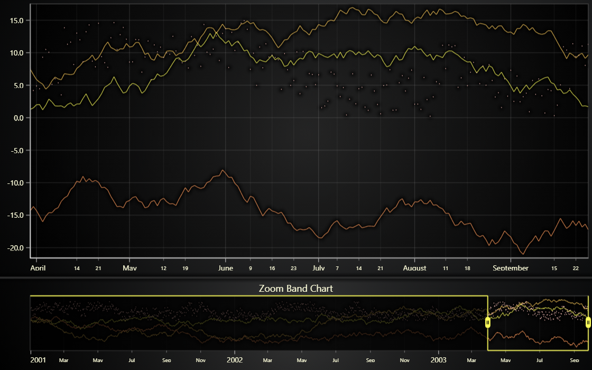

# JavaScript Zoom Band Chart



This demo application belongs to the set of examples for LightningChart JS, data visualization library for JavaScript.

LightningChart JS is entirely GPU accelerated and performance optimized charting library for presenting massive amounts of data. It offers an easy way of creating sophisticated and interactive charts and adding them to your website or web application.

The demo can be used as an example or a seed project. Local execution requires the following steps:

-   Make sure that relevant version of [Node.js](https://nodejs.org/en/download/) is installed
-   Open the project folder in a terminal:

          npm install              # fetches dependencies
          npm start                # builds an application and starts the development server

-   The application is available at _http://localhost:8080_ in your browser, webpack-dev-server provides hot reload functionality.


## Description

_Zoom Band Chart_.

This example showcases the Zoom Band Chart feature.
This is a chart type intended for displaying a duplicate, zoomed out view of 1 or more charts/series.
The Zoom Band Chart comes with convenient built-in interactions that allow the user to select the view on the full data set. Interacting with the Zoom Band Chart in that way mirrors the changes on the original, attached charts.

The Zoom Band Chart can be created with few simple lines of code:

```javascript
const zoomBandChart = lc.ZoomBandChart()
zoomBandChart.add(mySeries1)
zoomBandChart.add(mySeries2)
```

Please find more detailed documentation of Zoom Band Chart features and commonly used methods in the [API documentation](https://lightningchart.com/js-charts/api-documentation) under `ZoomBandChart` class.


## API Links

* [Zoom Band Chart]
* [XY cartesian chart]
* [Axis]
* [Axis tick strategies]
* [Horizontal legend box]
* [Vertical legend box]
* [UI position origins]
* [Solid FillStyle]
* [RGBA color factory]
* [Solid LineStyle]


## Support

If you notice an error in the example code, please open an issue on [GitHub][0] repository of the entire example.

Official [API documentation][1] can be found on [LightningChart][2] website.

If the docs and other materials do not solve your problem as well as implementation help is needed, ask on [StackOverflow][3] (tagged lightningchart).

If you think you found a bug in the LightningChart JavaScript library, please contact sales@lightningchart.com.

Direct developer email support can be purchased through a [Support Plan][4] or by contacting sales@lightningchart.com.

[0]: https://github.com/Arction/
[1]: https://lightningchart.com/lightningchart-js-api-documentation/
[2]: https://lightningchart.com
[3]: https://stackoverflow.com/questions/tagged/lightningchart
[4]: https://lightningchart.com/support-services/

© LightningChart Ltd 2009-2022. All rights reserved.


[Zoom Band Chart]: https://lightningchart.com/js-charts/api-documentation/v5.2.0/classes/ZoomBandChart.html
[XY cartesian chart]: https://lightningchart.com/js-charts/api-documentation/v5.2.0/classes/ChartXY.html
[Axis]: https://lightningchart.com/js-charts/api-documentation/v5.2.0/classes/Axis.html
[Axis tick strategies]: https://lightningchart.com/js-charts/api-documentation/v5.2.0/variables/AxisTickStrategies.html
[Horizontal legend box]: https://lightningchart.com/js-charts/api-documentation/v5.2.0/variables/LegendBoxBuilders.html
[Vertical legend box]: https://lightningchart.com/js-charts/api-documentation/v5.2.0/variables/LegendBoxBuilders.html
[UI position origins]: https://lightningchart.com/js-charts/api-documentation/v5.2.0/variables/UIOrigins.html
[Solid FillStyle]: https://lightningchart.com/js-charts/api-documentation/v5.2.0/classes/SolidFill.html
[RGBA color factory]: https://lightningchart.com/js-charts/api-documentation/v5.2.0/functions/ColorRGBA.html
[Solid LineStyle]: https://lightningchart.com/js-charts/api-documentation/v5.2.0/classes/SolidLine.html

