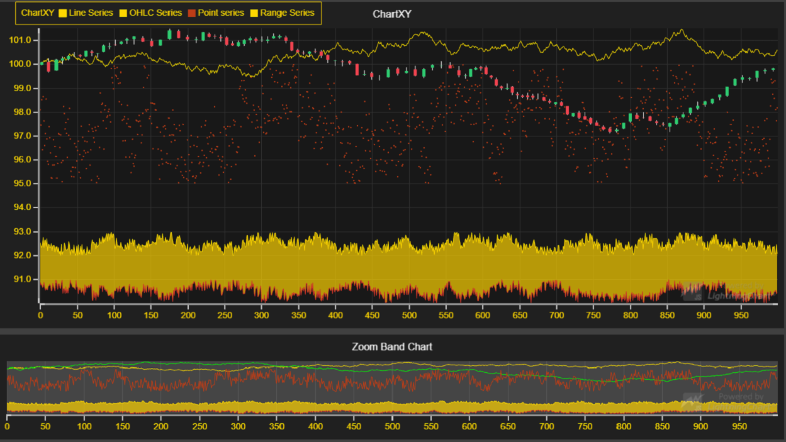

# Zoom Band Chart



This demo application belongs to the set of examples for LightningChart JS, data visualization library for JavaScript.

LightningChart JS is entirely GPU accelerated and performance optimized charting library for presenting massive amounts of data. It offers an easy way of creating sophisticated and interactive charts and adding them to your website or web application.

The demo can be used as an example or a seed project. Local execution requires the following steps:

- Make sure that relevant version of [Node.js](https://nodejs.org/en/download/) is installed
- Open the project folder in a terminal:

        npm install              # fetches dependencies
        npm start                # builds an application and starts the development server

- The application is available at *http://localhost:8080* in your browser, webpack-dev-server provides hot reload functionality.


## Description

This example shows the basic usage of a Zoom Band Chart.

The Zoom Band Chart is attached to an Axis of a separate XY Chart. It will then imitate the Series present in the attached Axis and display them accordingly. The band in Zoom Band Chart can be used to change the view in the XY Chart, making it an easy way to inspect the Series in the Chart.

When attaching to an X Axis, the Zoom Band Chart should be placed in a row either above or below the XY Chart it is attached to.
When attaching to a Y Axis, the Zoom Band Chart should be placed in a column next to the XY Chart it is attached to.

The Zoom Band Chart can only be created as a part of a Dashboard.

The Zoom Band Chart can be created with few simple lines of code:

```javascript
// Create a new Dashboard with one column and two rows.
const dashboard = lightningChart().Dashboard( {
    numberOfColumns: 1,
    numberOfRows: 2
} )

// Create a new ChartXY inside the Dashboard.
const chart = dashboard.createChartXY( {
    columnIndex: 0,
    columnSpan: 1,
    rowIndex: 0,
    rowSpan: 1
} )

// Create a new Zoom Band Chart inside the Dashboard, and attach to the X Axis of the XY Chart created before.
const zoomBandChart = dashboard.createZoomBandChart( {
    columnIndex: 0,
    columnSpan: 1,
    rowIndex: 1,
    rowSpan: 1,
    axis: chart.getDefaultAxisX()
} )
```

The band of the Zoom Band Chart can be modified by using *ZoomBandChart.band*:

```javascript
// Change the color of the Band.
zoomBandChart.band.setFillStyle( new SolidFill( { color: ColorHEX( '#57a2' ) } ) )
```


## API Links

* Zoom Band Chart: [ZoomBandChart]
* XY cartesian chart: [ChartXY]
* Axis: [Axis]
* Axis tick strategies: [AxisTickStrategies]
* Horizontal legend box: [HorizontalLegendBox]
* Vertical legend box: [VerticalLegendBox]
* UI position origins: [UIOrigins]
* Solid FillStyle: [SolidFill]
* RGBA color factory: [ColorRGBA]
* Solid LineStyle: [SolidLine]


## Support

If you notice an error in the example code, please open an issue on [GitHub][0] repository of the entire example.

Official [API documentation][1] can be found on [Arction][2] website.

If the docs and other materials do not solve your problem as well as implementation help is needed, ask on [StackOverflow][3] (tagged lightningchart).

If you think you found a bug in the LightningChart JavaScript library, please contact support@arction.com.

Direct developer email support can be purchased through a [Support Plan][4] or by contacting sales@arction.com.

[0]: https://github.com/Arction/
[1]: https://www.arction.com/lightningchart-js-api-documentation/
[2]: https://www.arction.com
[3]: https://stackoverflow.com/questions/tagged/lightningchart
[4]: https://www.arction.com/support-services/

© Arction Ltd 2009-2020. All rights reserved.


[ZoomBandChart]: https://www.arction.com/lightningchart-js-api-documentation/v1.2.0/classes/zoombandchart.html
[ChartXY]: https://www.arction.com/lightningchart-js-api-documentation/v1.2.0/classes/chartxy.html
[Axis]: https://www.arction.com/lightningchart-js-api-documentation/v1.2.0/classes/axis.html
[AxisTickStrategies]: https://www.arction.com/lightningchart-js-api-documentation/v1.2.0/globals.html#axistickstrategies
[HorizontalLegendBox]: https://www.arction.com/lightningchart-js-api-documentation/v1.2.0/globals.html#legendboxbuilders.horizontallegendbox
[VerticalLegendBox]: https://www.arction.com/lightningchart-js-api-documentation/v1.2.0/globals.html#legendboxbuilders.verticallegendbox
[UIOrigins]: https://www.arction.com/lightningchart-js-api-documentation/v1.2.0/globals.html#uiorigins
[SolidFill]: https://www.arction.com/lightningchart-js-api-documentation/v1.2.0/classes/solidfill.html
[ColorRGBA]: https://www.arction.com/lightningchart-js-api-documentation/v1.2.0/globals.html#colorrgba
[SolidLine]: https://www.arction.com/lightningchart-js-api-documentation/v1.2.0/classes/solidline.html

